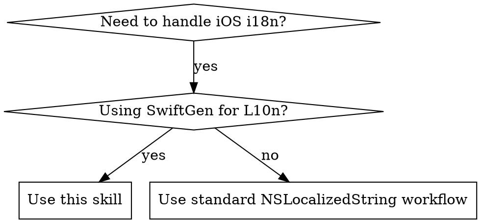

# iOS Internationalization Workflow

Complete workflow for managing iOS app internationalization (i18n) using SwiftGen. Handles baseline localization, translation verification across multiple languages, and automatic code generation.

## When to Use



**Use this skill when:**
- iOS apps using SwiftGen for code-generated L10n references
- Adding new localization keys to baseline language
- Verifying translation completeness across multiple languages
- Syncing localization files after code changes
- Replacing hardcoded strings with L10n.xxx calls

**Do NOT use when:**
- Projects using raw NSLocalizedString without SwiftGen
- Non-iOS platforms (Android, Web)
- Simple string replacements without localization structure

## Red Flags - STOP and Re-read

- "I'll just run swiftgen real quick"
- "The translations can wait"
- "I'll add the keys manually"
- "This phase doesn't apply to my case"
- "I can skip phase 4 and run it later"

**All of these mean: Read the skill again and follow all 4 phases in order.**

## Configuration

### Project Setup

Before using this workflow, configure these project-specific variables:

```yaml
# Project root (absolute path)
project_root: "/path/to/your/iOS/project"

# Localization directory (relative to project root)
localization_dir: "Resources/Localization"

# Baseline language (the source of truth for translations)
baseline_language: "zh-Hans"

# Target languages
target_languages:
  - "zh-Hant"  # Traditional Chinese
  - "en"       # English

# Generated Swift file output path (relative to project root)
generated_file: "Generated/Strings.swift"
```

**Default structure** (if not customized):
```
<ProjectRoot>/
└── <localization_dir>/
    ├── zh-Hans.lproj/Localizable.strings  # Baseline
    ├── zh-Hant.lproj/Localizable.strings
    └── en.lproj/Localizable.strings
```

## Workflow Overview

The workflow consists of 4 sequential phases:

```
Phase 1: Baseline Update → Phase 2: Target Translations → Phase 3: Additional Targets → Phase 4: Code Generation
```

**Key principle**: Each phase is independent. Complete Phase 1 before moving to Phase 2, etc.

### Phase 1: Baseline Localization

**Objective**: Update the baseline language file and replace hardcoded strings with L10n references.

1. **Extract strings from code**
   - Identify hardcoded strings in Swift/ObjC files
   - Cross-reference with baseline `Localizable.strings`

2. **Update baseline file**
   - Add new or modified strings to baseline language file
   - Follow naming conventions (see [Key Naming Convention](#key-naming-convention))

3. **Replace code with L10n references**
   - Replace hardcoded strings with `L10n.xxx` calls
   - Handle format strings properly (see [Format Strings](#format-strings-with-parameters))

**Task completion**: Once baseline file is updated and code references are replaced, Phase 1 is complete.

### Phase 2 & 3: Target Language Translations

**Objective**: Sync target language files with baseline.

For each target language:

1. **Check for missing keys**
   ```bash
   cd <project_root>
   python3 <skill_path>/scripts/check_missing_localizations.py \
     <localization_dir>/<baseline_lang>.lproj/Localizable.strings \
     <localization_dir>/<target_lang>.lproj/Localizable.strings
   ```

2. **Review the report**
   - Script outputs missing keys in target language file
   - Example:
     ```
     <target_lang>.lproj 文件缺失的键 (5 个)：
       "market.deposit"
       "market.totalassetvalue"
     ```

3. **Add missing translations**
   - Translate missing keys from baseline to target language
   - Add to target language file in appropriate sections

### Phase 4: Generate Swift Code

**Critical**: Must run after all localization changes.

```bash
cd <project_root>
swiftgen
```

This regenerates the `Strings.swift` file with new/updated L10n references.

## Quick Reference

| Task | Command/Approach | Phase |
|------|------------------|-------|
| Check missing translations | `python3 check_missing_localizations.py baseline target` | 2-3 |
| Clean unused entries | `python3 clean_unused_localizations.py --dry-run` | Any |
| Generate Swift code | `swiftgen` | 4 |
| Key naming rule | Letters/numbers/dots, start with letter | 1 |
| Format string → Function | `L10n.Xxx.func(arg1, arg2)` | 1 |
| Snake_case in key → camelCase in L10n | `futuresrecords.header.amount_usdt` → `L10n.Futuresrecords.Header.amountUsdt` | 1 |

## Common Mistakes

| Mistake | Why It Happens | Fix |
|---------|----------------|-----|
| Running swiftgen before syncing translations | Excitement to see changes immediately | Always complete all 4 phases in order |
| Using string interpolation on format functions | Thinking L10n.xxx.format is a string | Call it as a function: `L10n.Xxx.func(arg1, arg2)` |
| Translating placeholders like %@ | Wanting to "localize" everything | Preserve placeholders exactly: `%@`, `%d`, etc. |
| Naming keys starting with numbers | Thinking it's like variable names | Keys must start with letters: `secure3d` not `3dsecure` |
| Skipping phase 4 for "later" | Assuming code will compile | SwiftGen MUST run after all changes or code won't compile |
| Using old L10n reference after renaming key | Forgetting to update code | Always search and update all L10n references when keys change |

## Localization Key Naming Convention

**Rules**:
- Up to 3-level hierarchy with domain-like naming
- All lowercase letters, numbers (after first char), and dots (`.`)
- **Each segment MUST start with a letter (a-z), NOT a number**

**Examples**:
✅ `common.ok`
✅ `market.back`
✅ `market.header.name`
✅ `trade.confirm.title`

❌ `3dsecure.confirm` - First segment starts with number
❌ `symboldetail.24h.high` - Middle segment starts with number
❌ `2fa.enabled` - Starts with number

**✅ Valid Alternatives**:
- `secure3d.confirm` (use words instead of numbers)
- `symboldetail.twenty4h.high` (spell out numbers)
- `twofa.enabled` (spell out numbers)

## L10n Code Reference Rules

**Key transformation**:

| Localization Key | L10n Code Reference | Notes |
|-----------------|-------------------|-------|
| `common.ok` | `L10n.Common.ok` | Single level |
| `market.back` | `L10n.Market.back` | Two levels |
| `market.header.name` | `L10n.Market.Header.name` | Three levels |
| `addbalance.flashexchange.subtitle` | `L10n.Addbalance.Flashexchange.subtitle` | Compound word |
| `challenge.status.inprogress.full` | `L10n.Challenge.Status.Inprogress.full` | Nested |
| `futuresrecords.header.amount_usdt` | `L10n.Futuresrecords.Header.amountUsdt` | **snake_case → camelCase** |

**Rules**:
- All levels except last: Title Case (capitalize first letter only)
- Last level with underscores (`snake_case`): Convert to `camelCase`
- Last level without underscores: Keep as-is

## Format Strings (with Parameters)

**When localization strings contain format specifiers** (`%@`, `%d`, `%%`), SwiftGen generates a **FUNCTION**, not a static property.

**Example**:
```
Localization entry: "challenge.progress.stage" = "第%@阶段: %@";
```

**SwiftGen generates**:
```swift
public static func stage(_ p1: Any, _ p2: Any) -> String {
  return L10n.tr("Localizable", "challenge.progress.stage", String(describing: p1), String(describing: p2), fallback: "Phase %@: %@")
}
```

**✅ CORRECT Usage**:
```swift
tag.text = L10n.Challenge.Progress.stage(phaseText, statusText)
```

**❌ INCORRECT Usage**:
```swift
// DO NOT use String(format:) - it's a function, not a string!
tag.text = String(format: L10n.Challenge.Progress.stage, phaseText, statusText)
```

**Format specifier detection**:
- `%@` - Any object (String, etc.)
- `%d` / `%i` - Integer
- `%f` - Float/Double
- `%.0f` / `%.2f` - Formatted float
- `%%` - Literal percent sign (does NOT create a parameter)

## Helper Scripts

### Script Locations

Scripts are located in the skill's `scripts/` directory:
- `check_missing_localizations.py` - Check for missing translation keys
- `clean_unused_localizations.py` - Remove unused localization entries

**Usage patterns**:

```bash
# Option 1: Use absolute path to skill
python3 /path/to/ios-i18n-workflow/scripts/check_missing_localizations.py \
  <baseline_file> <target_file>

# Option 2: Copy scripts to project for convenience
cp /path/to/ios-i18n-workflow/scripts/*.py <project_root>/
python3 check_missing_localizations.py <baseline_file> <target_file>
```

### check_missing_localizations.py

**Purpose**: Compares localization files and reports missing keys.

**Usage**:
```bash
python3 check_missing_localizations.py \
  <localization_dir>/<baseline_lang>.lproj/Localizable.strings \
  <localization_dir>/<target_lang>.lproj/Localizable.strings
```

**Output format**:
```
📖 读取基准文件: zh-Hans.lproj/Localizable.strings
✅ 基准文件包含 150 个键

📖 读取比较文件 1: en.lproj/Localizable.strings
✅ 比较文件 1 包含 145 个键

==================================================
en.lproj 文件缺失的键 (5 个)：
  "market.deposit"
  "market.totalassetvalue"
  "challenge.newbie.title"

==================================================
📊 总结: 共发现 5 个缺失的键
==================================================
```

### clean_unused_localizations.py

**Purpose**: Finds and removes unused localization entries.

**Usage**:
```bash
# Auto-detect localization file (searches common locations)
python3 clean_unused_localizations.py

# Dry run (show what would be deleted)
python3 clean_unused_localizations.py --dry-run

# Specify custom paths
python3 clean_unused_localizations.py \
  --localizable-file /path/to/Localizable.strings \
  --source-dir /path/to/source

# Verbose mode (show detailed search process)
python3 clean_unused_localizations.py --verbose
```

**What it does**:
1. Auto-detects or uses specified `Localizable.strings` file
2. Converts snake_case keys to SwiftGen camelCase format
3. Searches codebase for `L10n.camelCaseKey` or `NSLocalizedString` references
4. Reports unused entries
5. Optionally deletes unused entries (with backup and confirmation)

**Requirements**:
- Searches in `.swift`, `.m`, `.mm`, `.h` files
- Excludes `Pods`, `build`, `DerivedData`, `.git` directories
- Automatically finds localization file in common locations

## Translation Guidelines

### General Principles (All Languages)

- **Preserve all placeholders** (`%@`, `%d`, `%lld`) exactly as in source
- **Consider UI context** (button labels should be brief and action-oriented)
- **Maintain consistency** with existing translations
- **Preserve file structure**, MARK comments, and formatting

### Language-Specific Guidelines

**For English (en)**:
- Use professional, concise language
- For financial/trading apps, use industry-standard terminology
- Use American English spelling conventions

**For Traditional Chinese (zh-Hant)**:
- Convert Simplified Chinese characters to Traditional Chinese
- Maintain terminology consistency
- Consider regional usage differences if applicable

**For other languages**:
- Follow locale-specific conventions
- Consider cultural context and idioms
- Consult native speakers when possible

## Important Constraints

**For ALL phases**:
- Only add/modify missing or outdated keys identified by scripts or requirements
- Do NOT edit or change existing, correct keys and values
- Preserve file structure, MARK comments, and formatting
- Maintain alphabetical or logical grouping within sections
- Only modify the specific language file for that phase

## Error Handling

**If SwiftGen errors occur after replacing strings**:
- Disregard the errors
- The task is still complete
- SwiftGen will be executed in Phase 4 to resolve them

**If script execution fails**:
- Verify file paths are correct (use `--localizable-file` parameter if auto-detection fails)
- Ensure Python 3 is installed: `python3 --version`
- Check file permissions for scripts: `chmod +x script_name.py`
- For `clean_unused_localizations.py`: Ensure you're in the project root directory or specify `--project-root`

## Best Practices

1. **Always start with Phase 1** - Establish baseline first
2. **Use baseline as source** for all target language comparisons
3. **Run swiftgen after all changes** - Critical for code consistency
4. **Test new translations in the app** - Verify context and formatting
5. **Clean up unused entries periodically** - Use `clean_unused_localizations.py`
6. **Preserve placeholders** - Never modify `%@`, `%d`, etc. in translations
7. **Follow naming conventions** - Ensure keys start with letters, not numbers

## Requirements

- Python 3.x
- SwiftGen (installed via Homebrew or Swift Package Manager)
- iOS project using SwiftGen for localization
- Access to localization files (typically `*.lproj/Localizable.strings`)

## Troubleshooting

**Script not found**:
```bash
# Verify you're in the correct directory
pwd  # Should be: <project_root>

# Check script exists
ls check_missing_localizations.py
ls clean_unused_localizations.py
```

**SwiftGen command fails**:
```bash
# Verify swiftgen is installed
which swiftgen

# If not installed, install via Homebrew
brew install swiftgen
```

**Permission denied on script**:
```bash
# Make script executable
chmod +x check_missing_localizations.py
chmod +x clean_unused_localizations.py
```

## Advanced Usage

For advanced workflows including CI/CD integration, batch processing, and automated translation scripts, see [advanced-usage.md](references/advanced-usage.md).

**Topics covered:**
- Custom language support
- CI/CD integration (GitHub Actions, Fastlane)
- Batch translation workflows
- Automated translation export
- SwiftGen configuration
- Localization file maintenance
- Performance optimization
- Testing localizations

