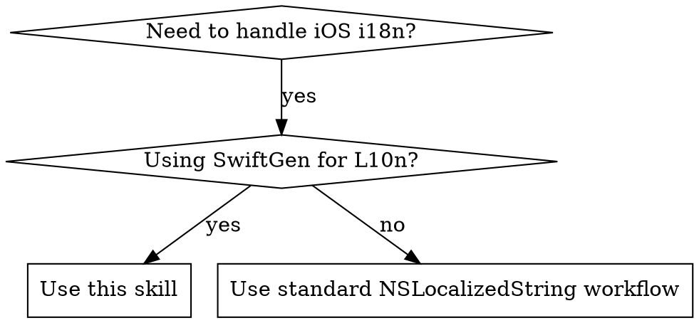

# iOS Internationalization Workflow

Complete workflow for managing iOS app internationalization (i18n) using SwiftGen. Handles baseline localization, translation verification across multiple languages, and automatic code generation.

## When to Use



**Use this skill when:**
- iOS apps using SwiftGen for code-generated L10n references
- Adding new localization keys to baseline language
- Verifying translation completeness across multiple languages
- Syncing localization files after code changes
- Replacing hardcoded strings with L10n.xxx calls

**Do NOT use when:**
- Projects using raw NSLocalizedString without SwiftGen
- Non-iOS platforms (Android, Web)
- Simple string replacements without localization structure

## Red Flags - STOP and Re-read

- "I'll just run swiftgen real quick"
- "The translations can wait"
- "I'll add the keys manually"
- "This phase doesn't apply to my case"
- "I can skip phase 4 and run it later"

**All of these mean: Read the skill again and follow all 4 phases in order.**

## Configuration

**Project-specific variables to configure:**

```yaml
project_root: "/path/to/your/iOS/project"
localization_dir: "Resources/Localization"
baseline_language: "zh-Hans"  # Source of truth
target_languages: ["zh-Hant", "en"]
generated_file: "Generated/Strings.swift"
```

**Default structure:**
```
<ProjectRoot>/<localization_dir>/
├── zh-Hans.lproj/Localizable.strings  # Baseline
├── zh-Hant.lproj/Localizable.strings
└── en.lproj/Localizable.strings
```

## Workflow Overview

**4 sequential phases:**
```
Phase 1: Baseline → Phase 2: Target 1 → Phase 3: Target 2 → Phase 4: SwiftGen
```

**Key principle:** Complete each phase before moving to next.

### Phase 1: Baseline Localization

Update baseline language file and replace hardcoded strings with L10n references.

1. Extract hardcoded strings from Swift/ObjC files
2. Add new/modified strings to baseline file following naming conventions
3. Replace strings with `L10n.xxx` calls

**Completion:** Baseline updated and code references replaced.

### Phase 2 & 3: Target Language Translations

For each target language:

```bash
python3 <skill_path>/scripts/check_missing_localizations.py \
  <localization_dir>/<baseline_lang>.lproj/Localizable.strings \
  <localization_dir>/<target_lang>.lproj/Localizable.strings
```

1. Review missing keys report
2. Translate missing keys from baseline
3. Add to target language file

### Phase 4: Generate Swift Code

**Critical:** Run after ALL changes.

```bash
cd <project_root>
swiftgen
```

## Quick Reference

| Task | Command/Approach | Phase |
|------|------------------|-------|
| Check missing translations | `python3 check_missing_localizations.py baseline target` | 2-3 |
| Clean unused entries | `python3 clean_unused_localizations.py --dry-run` | Any |
| Generate Swift code | `swiftgen` | 4 |
| Key naming rule | Letters/numbers/dots, start with letter | 1 |
| Format string → Function | `L10n.Xxx.func(arg1, arg2)` | 1 |
| Snake_case in key → camelCase in L10n | `futuresrecords.header.amount_usdt` → `L10n.Futuresrecords.Header.amountUsdt` | 1 |

## Common Mistakes

| Mistake | Why It Happens | Fix |
|---------|----------------|-----|
| Running swiftgen before syncing translations | Excitement to see changes immediately | Always complete all 4 phases in order |
| Using string interpolation on format functions | Thinking L10n.xxx.format is a string | Call it as a function: `L10n.Xxx.func(arg1, arg2)` |
| Translating placeholders like %@ | Wanting to "localize" everything | Preserve placeholders exactly: `%@`, `%d`, etc. |
| Naming keys starting with numbers | Thinking it's like variable names | Keys must start with letters: `secure3d` not `3dsecure` |
| Skipping phase 4 for "later" | Assuming code will compile | SwiftGen MUST run after all changes or code won't compile |
| Using old L10n reference after renaming key | Forgetting to update code | Always search and update all L10n references when keys change |

## Key Naming Convention

**Rules:**
- 3-level hierarchy max with domain-like naming
- Lowercase letters, numbers (after first char), dots
- **Each segment MUST start with a letter, NOT a number**

✅ `common.ok` | `market.header.name` | `trade.confirm.title`
❌ `3dsecure.confirm` | `symboldetail.24h.high` | `2fa.enabled`

**Fix:** Spell out numbers - `secure3d.confirm` → `threedsecure.confirm`

## L10n Code Reference Rules

| Key | L10n Reference | Transformation |
|-----|----------------|----------------|
| `common.ok` | `L10n.Common.ok` | Title Case |
| `market.header.name` | `L10n.Market.Header.name` | Multi-level Title Case |
| `futuresrecords.header.amount_usdt` | `L10n.Futuresrecords.Header.amountUsdt` | **snake_case → camelCase** |

**Rules:** All levels Title Case except last level converts snake_case to camelCase.

## Format Strings

When strings contain format specifiers (`%@`, `%d`, `%%`), SwiftGen generates a **FUNCTION**, not a static property.

**Example:**
```
"challenge.progress.stage" = "第%@阶段: %@";
```

**SwiftGen generates:**
```swift
public static func stage(_ p1: Any, _ p2: Any) -> String { ... }
```

**✅ Correct:** `L10n.Challenge.Progress.stage(phaseText, statusText)`
**❌ Wrong:** `String(format: L10n.Challenge.Progress.stage, ...)` - it's already a function!

**Format specifiers:**
- `%@` - Any object
- `%d`/`%i` - Integer
- `%f`/`%.2f` - Float/Double
- `%%` - Literal percent (no parameter created)

## Helper Scripts

Located in `scripts/` directory. For detailed usage and troubleshooting, see [scripts/README.md](scripts/README.md).

**Quick reference:**

| Script | Purpose | Quick Command |
|--------|---------|---------------|
| `check_missing_localizations.py` | Compare files for missing keys | `python3 scripts/check_missing_localizations.py <baseline> <target>` |
| `clean_unused_localizations.py` | Find/remove unused entries | `python3 scripts/clean_unused_localizations.py --dry-run` |

**Installation:**
```bash
# Copy to project for convenience
cp /path/to/ios-i18n-workflow/scripts/*.py <project_root>/
```

## Translation Guidelines

**Core principles:**
- Preserve all placeholders (`%@`, `%d`, `%lld`) exactly
- Consider UI context (button labels should be brief)
- Maintain consistency with existing translations

For detailed language-specific guidelines and best practices, see [references/translation-guidelines.md](references/translation-guidelines.md).

## Important Constraints

**For ALL phases**:
- Only add/modify missing or outdated keys identified by scripts or requirements
- Do NOT edit or change existing, correct keys and values
- Preserve file structure, MARK comments, and formatting
- Maintain alphabetical or logical grouping within sections
- Only modify the specific language file for that phase

## Error Handling

**SwiftGen errors after replacing strings**: Disregard. Phase 4 will resolve them.

**Script execution failures**:
- Verify file paths (use `--localizable-file` parameter if auto-detection fails)
- Ensure Python 3: `python3 --version`
- Check permissions: `chmod +x script_name.py`
- For `clean_unused_localizations.py`: Run from project root or specify `--project-root`

For detailed troubleshooting, see [scripts/README.md](scripts/README.md).

## Best Practices

1. Start with Phase 1 (baseline first)
2. Use baseline as source for all comparisons
3. Run `swiftgen` after ALL changes (critical)
4. Test translations in app
5. Clean unused entries periodically
6. Preserve placeholders (`%@`, `%d`) exactly
7. Follow naming conventions (start with letters)

## Requirements

- Python 3.x
- SwiftGen (`brew install swiftgen`)
- iOS project using SwiftGen for localization
- Access to `*.lproj/Localizable.strings` files

## Advanced Usage

For CI/CD integration, batch processing, automated translation, and performance optimization, see [references/advanced-usage.md](references/advanced-usage.md).

