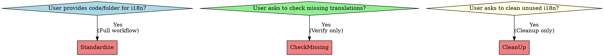

# iOS Internationalization Workflow

Complete workflow for managing iOS app internationalization (i18n) using SwiftGen L10n code generation. Supports any number of target languages. Covers three main scenarios: internationalizing code, verifying translation completeness, and cleaning unused entries.

## When to Use



**Three main scenarios:**

1. **Internationalize code** - User provides code or folder: "Here's my view controller, add i18n"
   → Run full workflow (baseline → ALL target languages → verify → SwiftGen)

2. **Check missing translations** - User explicitly asks: "Check if translations are complete" or "Find missing i18n keys"
   → Run check_missing_localizations.py for each target language and fill gaps

3. **Clean unused entries** - User explicitly asks: "Clean unused localizations" or "Remove unused i18n keys"
   → Run clean_unused_localizations.py with dry-run first

**Key principle:** Complete translations for ALL target languages before verification and SwiftGen generation.

**Do NOT use when:**
- Projects using raw NSLocalizedString without SwiftGen
- Non-iOS platforms (Android, Web)

## Identifying User Intent

**Determining which scenario applies:**

### Scenario 1: Full Workflow
User provides code files or folder paths, says things like "internationalize this" or "add i18n to this code"

### Scenario 2: Check Missing
User asks to verify translation completeness with phrases like "check if translations complete" or "find missing i18n keys"

### Scenario 3: Cleanup
User requests removal of unused entries with phrases like "clean unused localizations" or "remove unused i18n keys"

**Quick decision guide:**
- Provides code/folder → **Scenario 1** (Full workflow)
- Asks to check/verify → **Scenario 2** (Check missing)
- Asks to clean/remove → **Scenario 3** (Cleanup)

## Red Flags - STOP and Re-read

**For Scenario 1 (Full internationalization):**
- "I'll just run swiftgen real quick"
- "The translations can wait"
- "I'll add the keys manually"
- "This phase doesn't apply to my case"
- "I can skip phase 4 and run it later"
- "No need to verify with scripts, trust me"

**For Scenario 2 (Check missing):**
- "I can just eyeball the files"
- "Checking one target language is enough"
- "I'll add keys later"
- "The other languages look fine"

**For Scenario 3 (Cleanup):**
- "Just delete everything without checking"
- "No need for --dry-run first"

**All of these mean: Read the skill again and follow the correct workflow.**

## Configuration

**Project-specific variables:**
```yaml
project_root: "/path/to/your/iOS/project"
localization_dir: "*/Localization"
baseline_language: "zh-Hans"  # Source of truth (can be any language)
target_languages: ["zh-Hant", "en", "ja", "ko", "de"]  # ALL target languages
generated_file: "Generated/Strings.swift"
```

**Default structure:**
```
<ProjectRoot>/path/<localization_dir>/
├── zh-Hans.lproj/Localizable.strings  # Baseline (source of truth)
├── zh-Hant.lproj/Localizable.strings  # Target 1
├── en.lproj/Localizable.strings       # Target 2
└── ja.lproj/Localizable.strings       # Target 3 (add more as needed)
```

**Note:** The baseline language can be any language (zh-Hans, en, ja, etc.). Choose the language you work with most frequently as baseline.

## Scenario 1: Full Internationalization Workflow

**Use when:** User provides code/folder for internationalization

**Flow:** Sequential phases with iterative target language processing

```
Phase 1: Baseline → Phase 2+: Target Languages (repeat for ALL) → Verification → SwiftGen
```

**Critical:**
- Complete ALL target language translations sequentially before verification
- Verification step must confirm ALL languages aligned before SwiftGen
- If missing keys found, return to incomplete target language phase

### Phase 1: Baseline Localization

Update baseline language file and replace hardcoded strings with L10n references.

1. Extract hardcoded strings from Swift/ObjC files
2. Add new/modified strings to baseline file following naming conventions
3. Replace strings with `L10n.xxx` calls

**Completion:** Baseline updated and code references replaced.

### Phase 2+: Target Language Translations (Repeat for ALL Target Languages)

**For EACH target language in your configuration:**

1. **Identify new keys from Phase 1** - Review the keys added to baseline file
2. **Translate each new key** from baseline language to this target language
3. **Add translations** to this target language's `.strings` file following the same structure

**Process:**
- Complete ONE target language fully before moving to the next
- Copy new/modified keys from Phase 1 baseline
- Translate values (not keys) to target language
- Maintain same key names and structure as baseline
- Preserve placeholders like `%@`, `%d`, etc.

### Verification Step (CRITICAL)

**After completing ALL target language translations, verify alignment:**

This step confirms ALL translations are complete and aligned with baseline.

```bash
# Check each target language against baseline
for target_lang in "${target_languages[@]}"; do
  python3 <skill_path>/scripts/check_missing_localizations.py \
    <localization_dir>/<baseline_lang>.lproj/Localizable.strings \
    <localization_dir>/${target_lang}.lproj/Localizable.strings
done
```

**Example:** `python3 scripts/check_missing_localizations.py Localization/zh-Hans.lproj/Localizable.strings Localization/en.lproj/Localizable.strings`

**Expected output for EACH language:** `✅ [target] 文件没有缺失的键。`

**If missing keys found:** Return to the incomplete target language phase and add missing translations.

**Only proceed to Final Phase after verification confirms ALL languages aligned.**

### Final Phase: Generate Swift Code

**Critical:** Run after ALL changes and verification.

```bash
cd <project_root>
swiftgen
```

**Completion:** Code generated with all L10n references available for ALL languages.

## Scenario 2: Check Missing Translations

**Use when:** User explicitly asks "Check if translations are complete" or "Find missing i18n keys"

### Workflow

1. **Identify baseline language** (usually zh-Hans or en)
2. **Check EACH target language** against baseline:

```bash
python3 <skill_path>/scripts/check_missing_localizations.py \
  <localization_dir>/<baseline_lang>.lproj/Localizable.strings \
  <localization_dir>/<target_lang>.lproj/Localizable.strings
```

Repeat for ALL target languages.

3. **Review reports** - Each check shows missing keys for that target language
4. **Add missing translations** to each target language file
5. **Re-run verification** for all modified languages to confirm all aligned
6. **Run SwiftGen** if any translations were added

**Completion:** ALL target languages have complete translations matching baseline.

## Scenario 3: Clean Unused Localizations

**Use when:** User explicitly asks "Clean unused localizations" or "Remove unused i18n keys"

### Workflow

1. **Dry-run first** (see what would be deleted):

```bash
cd <project_root>
python3 <skill_path>/scripts/clean_unused_localizations.py --dry-run
```

2. **Review the report** - Shows unused entries and usage statistics
3. **Run actual cleanup** (after confirmation):

```bash
python3 <skill_path>/scripts/clean_unused_localizations.py
```

4. **Run SwiftGen** to regenerate code:

```bash
swiftgen
```

**Safety:**
- Script creates `.backup` file before deletion
- Prompts for confirmation before deleting
- Requires explicit user confirmation

**Completion:** Unused entries removed, SwiftGen regenerated.

## Quick Reference

### Scenario 1: Full Internationalization

| Task | Command/Approach | Phase |
|------|------------------|-------|
| Extract hardcoded strings | Manual review of provided code | 1 (Baseline) |
| Add keys to baseline | Edit baseline `.strings` file | 1 |
| Replace with L10n | `L10n.Module.key` syntax | 1 |
| Translate to ALL targets | Copy keys from baseline, translate values sequentially | 2+ |
| Verify alignment | `python3 scripts/check_missing_localizations.py <baseline> <target>` for EACH target | After ALL translations |
| Generate Swift code | `swiftgen` | Final |

### Scenario 2: Check Missing Only

| Task | Command |
|------|---------|
| Check each target | `python3 scripts/check_missing_localizations.py <baseline> <target>` for ALL targets |
| Add missing keys | Edit target `.strings` files |
| Verify fixed | Re-run check script for all modified targets |
| Generate (if changed) | `swiftgen` |

### Scenario 3: Cleanup Only

| Task | Command |
|------|---------|
| Preview cleanup | `python3 scripts/clean_unused_localizations.py --dry-run` |
| Execute cleanup | `python3 scripts/clean_unused_localizations.py` |
| Regenerate | `swiftgen` |

## Common Mistakes

| Mistake | Fix | Scenario |
|---------|-----|----------|
| Running swiftgen before syncing ALL translations | Always complete ALL target language translations before SwiftGen | 1 |
| Skipping verification step | Always run check script after ALL target translations to confirm ALL languages aligned | 1 |
| Only verifying some target languages | Check EVERY target language against baseline before SwiftGen | 1, 2 |
| Using string interpolation on format functions | Call as function: `L10n.Xxx.func(arg1, arg2)` | 1 |
| Translating placeholders like %@ | Preserve placeholders exactly: `%@`, `%d`, etc. | 1, 2, 3, 4 |
| Naming keys starting with numbers | Keys must start with letters: `secure3d` not `3dsecure` | 1, 4 |
| Skipping final phase for "later" | SwiftGen MUST run after all changes or code won't compile | 1, 2, 3 |
| Cleanup without --dry-run first | Always preview what will be deleted before actual cleanup | 3 |
| Forgetting SwiftGen after cleanup | Must regenerate code after removing unused keys | 3 |

## Key Rules

### 0. Multi-Language Workflow (CRITICAL)

**For projects with multiple target languages:**

- **Sequential completion:** Finish ONE target language completely before starting the next
- **Baseline as source:** Always copy keys from baseline, never between target languages
- **Verify ALL languages:** Every target language must be checked against baseline before SwiftGen

**Workflow:** `Baseline → Target1 → Target2 → ... → TargetN → Verify ALL → SwiftGen (once)`

### 1. Localization Key Naming

**Core requirements:**
- Domain-like naming with hierarchical structure
- **All lowercase** letters, numbers (after first character), and dots (.)
- **CRITICAL**: Each segment MUST start with a **letter** (a-z), NOT a number
- Use descriptive, domain-based names for clarity

**Examples:**
```
✅ common.ok
✅ market.header.name
✅ trade.confirm.title
✅ futuresrecords.header.amount_usdt

❌ symboldetail.24h.high (number in middle) → Use symboldetail.daily.high
❌ 2fa.enabled (starts with number) → Use twofa.enabled
```

### 2. L10n Code Reference Transformation

**SwiftGen auto-transforms keys to code references:**

- **All levels except last**: Title Case (capitalize first letter only)
- **Last level**:
  - Contains underscores (`snake_case`) → convert to `camelCase`
  - Single lowercase word → keep as-is
  - Compound words without underscores → stay lowercase

**Examples:**
| Localization Key | L10n Reference | Notes |
|-----------------|----------------|-------|
| `common.ok` | `L10n.Common.ok` | Single level |
| `market.header.name` | `L10n.Market.Header.name` | All Title Case |
| `futuresrecords.header.amount_usdt` | `L10n.Futuresrecords.Header.amountUsdt` | Last: snake_case → camelCase |
| `paybridge.error.missingproductid` | `L10n.Paybridge.Error.missingproductid` | Compound stays lowercase |
| `challenge.status.inprogress.full` | `L10n.Challenge.Status.Inprogress.full` | inprogress → Inprogress |

### 3. Format Strings (with Parameters)

**When localization strings contain format specifiers** (`%@`, `%d`, `%f`, etc.), SwiftGen generates a **FUNCTION**, not a static property.

**Format specifier examples:**
- `%@` - Any object (String, etc.)
- `%d` / `%i` - Integer
- `%f` - Float/Double
- `%.2f` - Formatted float
- `%%` - Literal percent (does NOT create parameter)

**Usage examples:**
```swift
// Static property (no format specifiers)
button.setTitle(L10n.Common.ok, for: .normal)

// Function call (with format specifiers)
label.text = L10n.Challenge.Progress.stage(phaseText, statusText)
label.text = L10n.Futurestrading.Orderbook.fundingrate(8)
```

**For detailed examples, troubleshooting, and migration guide:** See [references/naming-conventions.md](references/naming-conventions.md)

## Helper Scripts

Located in `scripts/` directory. For detailed usage, see [scripts/README.md](scripts/README.md).

| Script | Purpose | Command |
|--------|---------|---------|
| `check_missing_localizations.py` | Compare files for missing keys | `python3 scripts/check_missing_localizations.py <baseline> <target>` |
| `clean_unused_localizations.py` | Find/remove unused entries | `python3 scripts/clean_unused_localizations.py --dry-run` |

## Important Constraints

**For ALL phases:**
- Only add/modify missing or outdated keys identified by scripts or requirements
- Do NOT edit existing, correct keys and values
- Preserve file structure, MARK comments, and formatting
- Maintain alphabetical or logical grouping
- Only modify the specific language file for that phase

## Best Practices

### For All Scenarios
- Always verify with scripts before assuming completeness
- Run SwiftGen after any localization file changes
- Test translations in actual app context

### For Scenario 1 (Full Workflow)
- Start with baseline phase first
- **Complete ALL target language translations before running verification**
- **Verify EVERY target language against baseline before SwiftGen**
- Complete each phase fully before next

### For Scenario 2 (Check Missing)
- Check ALL target languages, not just one
- Re-run verification after adding missing keys
- Run SwiftGen if any keys were added

### For Scenario 3 (Cleanup)
- Always use --dry-run first
- Review the cleanup report before confirming
- Clean periodically (e.g., before releases)
- Keep backup files until verified in app

## Requirements

- Python 3.x
- SwiftGen (`brew install swiftgen`)
- iOS project using SwiftGen for localization
- Access to `*.lproj/Localizable.strings` files

## Advanced Usage

For CI/CD integration, automated translation, and performance optimization, see [references/advanced-usage.md](references/advanced-usage.md).
