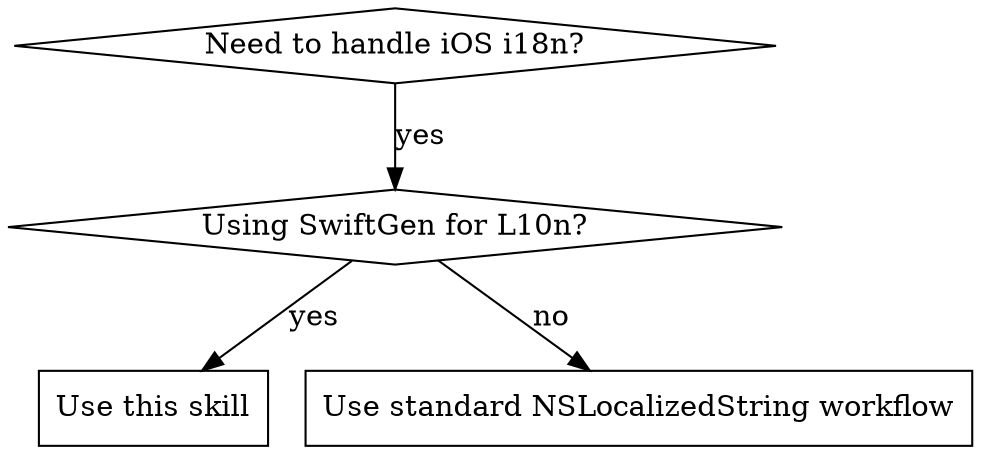

# iOS Internationalization Workflow

Complete workflow for managing iOS app internationalization (i18n) using SwiftGen. Handles baseline localization, translation verification, and code generation.

## When to Use



**Use when:**
- iOS apps using SwiftGen for code-generated L10n references
- Adding new localization keys or verifying translation completeness
- Syncing localization files after code changes
- Replacing hardcoded strings with L10n.xxx calls

**Do NOT use when:**
- Projects using raw NSLocalizedString without SwiftGen
- Non-iOS platforms (Android, Web)

## Red Flags - STOP and Re-read

- "I'll just run swiftgen real quick"
- "The translations can wait"
- "I'll add the keys manually"
- "This phase doesn't apply to my case"
- "I can skip phase 4 and run it later"

**All of these mean: Read the skill again and follow all 4 phases in order.**

## Configuration

**Project-specific variables:**
```yaml
project_root: "/path/to/your/iOS/project"
localization_dir: "Resources/Localization"
baseline_language: "zh-Hans"  # Source of truth
target_languages: ["zh-Hant", "en"]
generated_file: "Generated/Strings.swift"
```

**Default structure:**
```
<ProjectRoot>/<localization_dir>/
├── zh-Hans.lproj/Localizable.strings  # Baseline
├── zh-Hant.lproj/Localizable.strings
└── en.lproj/Localizable.strings
```

## Workflow Overview

**4 sequential phases:**
```
Phase 1: Baseline → Phase 2: Target 1 → Phase 3: Target 2 → Phase 4: SwiftGen
```

**Key principle:** Complete each phase before moving to next.

### Phase 1: Baseline Localization

Update baseline language file and replace hardcoded strings with L10n references.

1. Extract hardcoded strings from Swift/ObjC files
2. Add new/modified strings to baseline file following naming conventions
3. Replace strings with `L10n.xxx` calls

**Completion:** Baseline updated and code references replaced.

### Phase 2 & 3: Target Language Translations

For each target language:

```bash
python3 <skill_path>/scripts/check_missing_localizations.py \
  <localization_dir>/<baseline_lang>.lproj/Localizable.strings \
  <localization_dir>/<target_lang>.lproj/Localizable.strings
```

1. Review missing keys report
2. Translate missing keys from baseline
3. Add to target language file

### Phase 4: Generate Swift Code

**Critical:** Run after ALL changes.

```bash
cd <project_root>
swiftgen
```

## Quick Reference

| Task | Command/Approach | Phase |
|------|------------------|-------|
| Check missing translations | `python3 scripts/check_missing_localizations.py <baseline> <target>` | 2-3 |
| Clean unused entries | `python3 scripts/clean_unused_localizations.py --dry-run` | Any |
| Generate Swift code | `swiftgen` | 4 |
| Key naming rule | Letters/numbers/dots, start with letter | 1 |
| Format string → Function | `L10n.Xxx.func(arg1, arg2)` | 1 |

## Common Mistakes

| Mistake | Fix |
|---------|-----|
| Running swiftgen before syncing translations | Always complete all 4 phases in order |
| Using string interpolation on format functions | Call as function: `L10n.Xxx.func(arg1, arg2)` |
| Translating placeholders like %@ | Preserve placeholders exactly: `%@`, `%d`, etc. |
| Naming keys starting with numbers | Keys must start with letters: `secure3d` not `3dsecure` |
| Skipping phase 4 for "later" | SwiftGen MUST run after all changes or code won't compile |

## Key Rules

**Quick summary:**
- Keys: 3-level hierarchy, lowercase, MUST start with letters (not numbers)
- L10n refs: Title Case for all levels, last level snake_case → camelCase
- Format strings: Generate FUNCTIONS, not properties

**Examples:**
✅ `common.ok` → `L10n.Common.ok`
✅ `market.header.name` → `L10n.Market.Header.name`
✅ `futuresrecords.header.amount_usdt` → `L10n.Futuresrecords.Header.amountUsdt`
❌ `3dsecure.confirm` (starts with number) → Use `secure3d.confirm`

**For detailed rules, examples, and troubleshooting:** See [references/naming-conventions.md](references/naming-conventions.md)

## Helper Scripts

Located in `scripts/` directory. For detailed usage, see [scripts/README.md](scripts/README.md).

| Script | Purpose | Command |
|--------|---------|---------|
| `check_missing_localizations.py` | Compare files for missing keys | `python3 scripts/check_missing_localizations.py <baseline> <target>` |
| `clean_unused_localizations.py` | Find/remove unused entries | `python3 scripts/clean_unused_localizations.py --dry-run` |

## Important Constraints

**For ALL phases:**
- Only add/modify missing or outdated keys identified by scripts or requirements
- Do NOT edit existing, correct keys and values
- Preserve file structure, MARK comments, and formatting
- Maintain alphabetical or logical grouping
- Only modify the specific language file for that phase

## Best Practices

1. Start with Phase 1 (baseline first)
2. Use baseline as source for all comparisons
3. Run `swiftgen` after ALL changes (critical)
4. Test translations in app
5. Clean unused entries periodically

## Requirements

- Python 3.x
- SwiftGen (`brew install swiftgen`)
- iOS project using SwiftGen for localization
- Access to `*.lproj/Localizable.strings` files

## Advanced Usage

For CI/CD integration, automated translation, and performance optimization, see [references/advanced-usage.md](references/advanced-usage.md).
